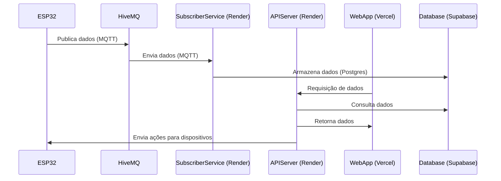

# IoT Hub

Esse repositório concentra os trabalhos desenvolvidos para a matéria de `PJI2` (Projeto Integrador 2) do curso de Engenharia de Telecomunicações do IFSC-SJ

### Projeto

O projeto consiste no desenvolvimento de um sistema de monitoramento de temperatura, umidade e luminosidade de ambientes. Onde deverá ser desenvolvido tanto o hardware quanto o software para a coleta e envio dos dados para um servidor na nuvem.

### Hardware

O hardware é composto por um microcontrolador ESP32, sensores de temperatura, umidade e luminosidade, e um módulo de comunicação WiFi. O microcontrolador é responsável por coletar os dados dos sensores e enviar para um servidor na nuvem.

Foi optado pela linguagem de programação `C++` para o desenvolvimento do firmware do microcontrolador. A IDE utilizada foi a `VSCode` com a extensão `PlatformIO`.

### Software

Foi optado por dividir as responsabilidades do software em serviços distintos, sendo eles:

- `subscriber`: Responsável por receber os dados enviados pelo microcontrolador e armazenar em um banco de dados.
- `api`: Responsável por disponibilizar uma API para consulta dos dados armazenados no banco de dados e enviar ações para os dispositivos.
- `web`: Responsável por disponibilizar uma interface web para visualização dos dados e controle dos dispositivos.

### Tecnologias

- `C++`: Linguagem de programação utilizada no firmware do microcontrolador.
- `Go`: Linguagem de programação utilizada no desenvolvimento dos serviços `subscriber` e `api`.
- `NextJS`: Framework utilizado no desenvolvimento do serviço `web`.
- `Docker`: Utilizado para containerização dos serviços para teste local.
- `Postgres`: Banco de dados utilizado para armazenamento dos dados.
- `MQTT`: Protocolo de comunicação utilizado para comunicação com o microcontrolador.

### Serviços em nuvem

Para hospedagem dos serviços foram escolhidos as seguintes plataformas uma vez que oferecem planos gratuitos:

- `HiveMQ`: Broker MQTT utilizado para comunicação com o microcontrolador.
- `Render`: Serviço de hospedagem utilizado para hospedar os serviços `api` e `subscriber`.
- `Vercel`: Serviço de hospedagem utilizado para hospedar o serviço `web`.
- `Supabase`: Serviço de hospedagem utilizado para hospedar o banco de dados.

### Diagrama de sequência

